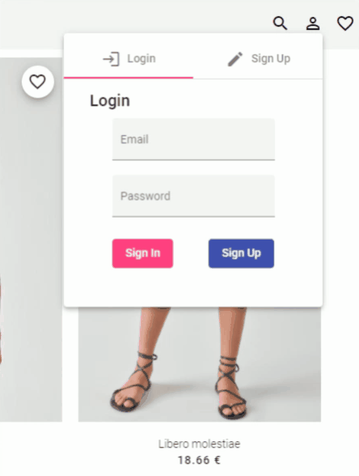

# Kix Clothing - A Machine Learning Showroom


> Kix Clothing is born as a clear idea, a platform where users can easily access their favorite clothes and easily search using images to find those clothes that they may like or that are similar to those they already have.
> 
> Sergio de Los Santos


# Presentation

This project makes use of the **Machine Learning** model provided by Google called **Vision Cloud**. This API, analyzes in real time images previously indexed in the database to find products that are either similar or identical.

I had always wanted to learn how to use the **Google Cloud Platform** and go deeper into the world of Machine Learning, and this job has been the perfect opportunity to be able to learn both at the same time.

The api consists of two parts that must be put together, the **Vision Cloud API** itself and a **Google Storage Bucket** where we must place the images to be able to index them and for the system to be able to recognize them.

# Highlights




# Future implementations

In the future I would like to implement a payment system, a normal text search engine, categories on the web to be able to filter the products, etc..
We have had little time, this week has been quite intense and I have not been able to perform all the features I had proposed, which I will implement over these weeks as it is a project that I liked very much to do

# Technologies

Several technologies have been used throughout the project, among which I would like to highlight:

- Java Spring Boot for the Back-End
- Netflix OSS Feign and Eureka for the connection of microservices.
- Google Cloud Vision API as a search engine
- Google Storage for image data storage
- MongoDB for product storage
- Angular and TypeScript for the Front-End part

## Microservices

In total, 5 microservices have been implemented for this project.

- Product microservices: It is the one in charge of managing the products we have, and it is one of the main microservices of the application.
- Image Microservice: It provides the necessary infrastructure to upload the images to the Google Storage platform, it also manages the links, their ids and it is the one that provides the resources to the product microservice.
- Search engine microservice: This is the system in charge of performing searches on the Cloud Vision platform. It is the microservice that has implemented the logic used in the search for products with images. In the future I would like to improve it and include a semantic search engine.
- User microservices: It manages all users, it is also in charge of saving wish lists and providing user authentication
- Edge Microservice: The director of this entire orchestra, handles all requests and make the page work properly. I would like to be able to implement Hystrix and Ribbon in the future to make it fault and crash-tolerant.

# How to use this application
Due to the difficulty I had with the passport.json file, I have made the deployment in Heroku so that the application can be checked and used
## Using Deploy

You can access to the app using this link the front-end application deployed in Heroku

> ### Important Note
>
> Due to the nature of Heroku's free account, some times the application may not work properly,
> Please keep it in mind.

> https://kix-frontend.herokuapp.com/

| Microservice | Url 
| ------------- | ------------- 
| Front End  | https://kix-frontend.herokuapp.com/
| Edge Service  | https://kix-edge.herokuapp.com/
| User Service  | https://kix-users.herokuapp.com/
| Product Service  | https://kix-products.herokuapp.com/
| Image Service  | https://kix-images.herokuapp.com/
| Search Service  | https://kix-search.herokuapp.com/
| Eureka Service  | https://kix-eureka-server.herokuapp.com/

## Credentials
You can use this credentials in order to use the web application

| User | Password | Role
| ------------- | ------------- |--------|
| admin@admin.com  | admin  | admin
| sergio@santos.com  | sergio  | client

## Deploy in local
### Configure Google Service

To use this application you need a passport.json file provided by Google with the keys needed to access the service, ~~these keys are included in the search engine microservice in the root folder, you just have to create an environment variable called GOOGLE_APPLICATION_CREDENTIALS~~

**For security reasons, I've had to delete the passport.json, if you need it, let me know**

```java
export GOOGLE_APPLICATION_CREDENTIALS="/path/to/passport.json"
```

This application requires pre-loaded data, since the google learning model has them learned so it is very likely that the application will fail if the data is not entered correctly from the beginning.
In the corresponding microservices, there is a file **data.sql** or **data.json** that you should use to preload this data in your local computer

## Postman API
https://documenter.getpostman.com/view/11779377/T1DpDdbb
